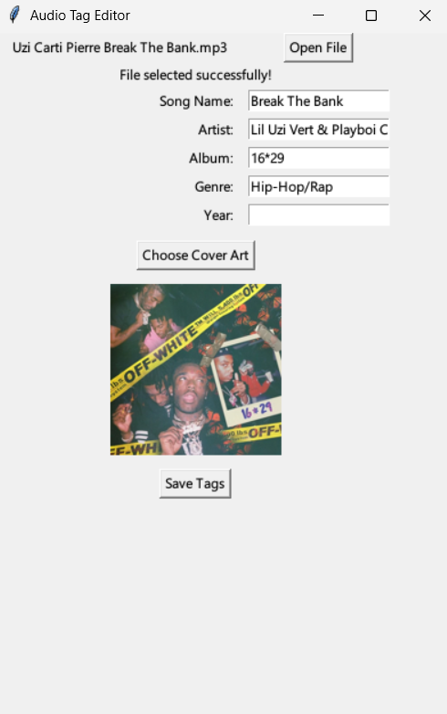

# MP3 Tag Editor

A minimal Python app to update song metadata — title, artist, album, genre, and album art — using the `mutagen` library. Built with a simple GUI using `tkinter`.

---

## 🛠 Features

- Edit title, artist, album, genre
- Add or replace album art
- Select audio file and cover image via file dialog
- Lightweight and easy to use

---

## 🚀 Getting Started

### Prerequisites

- Python 3.8+
- pip

### Install dependencies

```bash
pip install mutagen pillow
````

---

## 🖥️ Run the App

```bash
python main.py
```

---

---

## 📸 Screenshot



